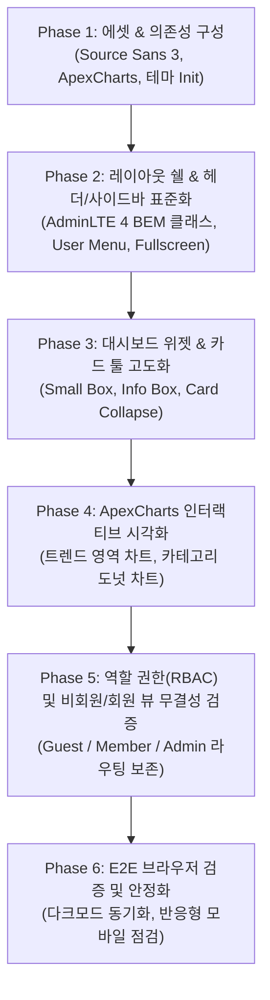

# 📋 J뉴스보드 리팩토링 종합 계획서 (AdminLTE v4 표준 규격 반영)

> **참조 사이트**: [AdminLTE v4 Official Theme Demo](https://adminlte.io/themes/v4/index.html)  
> **프로젝트**: J뉴스보드 (커뮤니티 게시판 & 관리자 플랫폼)  
> **작성일**: 2026-09-22  
> **상태**: ✅ 리팩토링 및 E2E 브라우저 검증 완료

---

## 1. 개요 및 리팩토링 목적

본 계획서는 공식 **AdminLTE v4** 최신 디자인 가이드라인 및 컴포넌트 아키텍처를 분석하여, 현재 구동 중인 `J뉴스보드` 애플리케이션의 관리자 대시보드와 UI/UX를 공식 데모 수준으로 리팩토링하기 위한 단계별 실행 로드맵입니다.

### 핵심 목표
1. **공식 AdminLTE v4 규격 100% 일치**: 공식 데모(`index.html`)의 DOM 쉘 구조, BEM 클래스 네이밍, 아이콘 체계, 컬러 스킴 반영.
2. **고급 위젯 및 컴포넌트 고도화**: 기본 부트스트랩 카드를 AdminLTE v4 정통 `.small-box`, `.info-box`, `.card-tools`로 교체.
3. **인터랙티브 차트(ApexCharts) 도입**: 단순 CSS 막대그래프로 표현되던 통계를 공식 데모와 동일한 ApexCharts 기반의 인터랙티브 차트로 업그레이드.
4. **역할 기반 접근 제어(RBAC) 완전 보존**:
   - **비회원(Guest)**: 서비스 소개 & 최근 게시글 미리보기가 포함된 와이드 풀페이지 반응형 홈페이지
   - **일반회원(Member)**: 대시보드 진입 제한 및 심플한 게시판 전용 화면
   - **관리자(Admin)**: AdminLTE v4 풀스펙 관리자 대시보드 및 전체 관리 기능
5. **완벽한 다크/라이트 모드 지원**: AdminLTE 4 테마 스크립트 및 차트 다크모드 자동 동기화.

---

## 2. AdminLTE v4 공식 규격 vs 현재 J뉴스보드 비교 분석 (Gap Analysis)

| 구분 | AdminLTE v4 공식 규격 (`index.html`) | 현재 J뉴스보드 구현 상태 | 리팩토링 과제 |
| :--- | :--- | :--- | :--- |
| **기본 폰트** | `Source Sans 3` (Google Fonts) | `Inter` | `Source Sans 3` 웹폰트 추가 및 타이포그래피 정돈 |
| **테마 초기화** | `<head>` 인라인 스크립트로 FOUC 방지 | JS 번들 로드 후 `initTheme()` 호출 | `<head>`에 공식 인라인 테마 판별 스크립트 이식 |
| **레이아웃 쉘** | `body.layout-fixed.sidebar-expand-lg` + `.app-wrapper` | `.app-wrapper` 단일 div 사용 | 공식 Body 클래스 및 `.app-main > .app-content-header > .app-content` 구조 완비 |
| **헤더 네비게이션** | • 전체화면 토글 (`data-lte-toggle="fullscreen"`)<br>• 알림/메시지 배지 드롭다운<br>• 공식 `.user-menu` (`.user-header`, `.user-footer`) | • 기본 알림/메시지 부재<br>• 심플 드롭다운<br>• 전체화면 토글 미지원 | • 전체화면 토글 및 아이콘 전환 구현<br>• 실시간 알림 드롭다운 추가<br>• 정통 AdminLTE 4 `.user-header` 스타일 적용 |
| **사이드바** | • 브랜드 링크 (`.brand-image`, `.brand-text.fw-light`)<br>• 트리뷰 아이콘 (`.nav-arrow.bi-chevron-right`)<br>• `.nav-badge.badge.text-bg-*` | • 간이 아이콘 + 텍스트 링크<br>• 트리뷰 화살표 없음 | • 공식 브랜드 로고 및 뱃지 스타일 적용<br>• 네비게이션 메뉴 화살표 및 액티브 상태 정교화 |
| **대시보드 위젯** | • `.small-box.text-bg-primary\|success\|warning\|danger`<br>• `.small-box-icon` (배경 일체형 아이콘)<br>• `.small-box-footer` 링크 | • 일반 Bootstrap `stat-card` | • AdminLTE v4 시그니처 `.small-box` 위젯 4종으로 전면 교체 |
| **카드 인터랙션** | • `.card-tools` (접기/펼치기, 닫기 버튼)<br>• `.card-primary.card-outline` | • 고정형 정적 카드 | • 카드 접기(`card-collapse`) 및 새로고침/삭제 컨트롤러 구현 |
| **차트 & 시각화** | • **ApexCharts** 라이브러리 활용 (주간 매출, 접속 추이, 방문자 통계 등) | • 순수 CSS `div` 높이 조절 방식 | • **ApexCharts** 연동 (주간 활동 트렌드, 카테고리별 도넛 차트) |

---

## 3. 단계별 상세 리팩토링 계획 (Implementation Roadmap)



---

### Phase 1: 에셋 및 의존성 환경 구축
- **1.1. ApexCharts 라이브러리 도입**:
  - `npm install apexcharts` 설치
  - 모듈 번들러(Vite)에서 안정적으로 로드될 수 있도록 구성
- **1.2. 웹폰트 및 테마 초기화 스크립트 (`index.html`)**:
  - AdminLTE v4 표준인 `Source Sans 3` 폰트 링크 추가
  - 깜빡임(FOUC) 없이 다크/라이트 테마를 즉시 적용하는 인라인 `<script>` 헤더 배치:
    ```javascript
    const storedTheme = localStorage.getItem('lte-theme');
    const theme = storedTheme || (window.matchMedia('(prefers-color-scheme: dark)').matches ? 'dark' : 'light');
    document.documentElement.setAttribute('data-bs-theme', theme === 'auto' ? (window.matchMedia('(prefers-color-scheme: dark)').matches ? 'dark' : 'light') : theme);
    ```

---

### Phase 2: 레이아웃 쉘 및 네비게이션 고도화

#### 2.1. 공식 Header 네비게이션 (`.app-header`)
- **전체화면 토글 (`data-lte-toggle="fullscreen"`)**:
  - 클릭 시 브라우저 Fullscreen API 구동
  - `bi-arrows-fullscreen` <-> `bi-fullscreen-exit` 아이콘 토글 처리
- **알림 센터 드롭다운 (Notification Center)**:
  - 신규 게시글, 신규 회원 가입 알림 목록 표시 (`.dropdown-menu-lg`)
  - 안 읽은 알림 카운트 뱃지 표시 (`badge text-bg-warning`)
- **공식 User Menu (`.nav-item.dropdown.user-menu`)**:
  - 공식 AdminLTE v4 구조 도입:
    ```html
    <li class="nav-item dropdown user-menu">
      <a href="#" class="nav-link dropdown-toggle" data-bs-toggle="dropdown">
        
        <span class="d-none d-md-inline">관리자</span>
      </a>
      <ul class="dropdown-menu dropdown-menu-end dropdown-menu-lg shadow">
        <li class="user-header text-bg-primary">
          
          <p>관리자 - System Operator<small>가입일: 2025-01-01</small></p>
        </li>
        <li class="user-body">...</li>
        <li class="user-footer d-flex justify-content-between">
          <button class="btn btn-default btn-flat" data-admin-page="settings">프로필/설정</button>
          <button class="btn btn-default btn-flat text-danger" id="adminLogoutBtn">로그아웃</button>
        </li>
      </ul>
    </li>
    ```

#### 2.2. 공식 Sidebar 구조 (`.app-sidebar`)
- **브랜드 로고 영역 (`.sidebar-brand`)**:
  - 로고 아이콘/이미지 + `.brand-text.fw-light` 타이틀
- **사이드바 메뉴 (`.sidebar-menu`)**:
  - 각 메뉴 아이템에 `.nav-arrow.bi-chevron-right` 화살표 추가
  - 실시간 활성 뱃지(`.nav-badge.badge.text-bg-info`) 적용
  - 사이드바 접기/펼치기 시 부드러운 애니메이션 보장

---

### Phase 3: 대시보드 위젯 및 카드 컨트롤러 리팩토링

#### 3.1. AdminLTE v4 시그니처 Small-Box 적용
기존의 밋밋한 사각 카드를 공식 컬러 박스로 교체:
- **전체 게시글**: `.small-box.text-bg-primary` (아이콘: `bi-file-earmark-text`)
- **오늘 신규글**: `.small-box.text-bg-success` (아이콘: `bi-pencil-square`)
- **누적 조회수**: `.small-box.text-bg-info` (아이콘: `bi-eye`)
- **전체 회원수**: `.small-box.text-bg-warning` (아이콘: `bi-people`)
- 하단 링크: `.small-box-footer` ("자세히 보기 <i class='bi bi-arrow-circle-right'></i>") 클릭 시 해당 관리 탭으로 즉시 이동

#### 3.2. 인터랙티브 카드 도구 (`.card-tools`)
- 모든 주요 카드 헤더에 접기/펼치기 (`data-lte-toggle="card-collapse"`) 버튼 적용
- 닫기/삭제 (`data-lte-toggle="card-remove"`) 이벤트 바인딩으로 사용자가 위젯을 자유롭게 제어 가능하도록 지원

---

### Phase 4: ApexCharts 기반 인터랙티브 시각화

기존의 정적 HTML/CSS 차트를 공식 AdminLTE v4 스타일의 실시간 대화형 차트로 전면 교체합니다.

1. **주간 활동 & 게시글/조회수 트렌드 차트 (Spline Area Chart)**:
   - x축: 최근 7일 (월 ~ 일)
   - y축 1: 일별 게시글 등록 수
   - y축 2: 일별 누적 조회수
   - 툴팁 마우스 호버 시 상세 통계 말풍선 지원
2. **카테고리별 점유율 차트 (Donut Chart)**:
   - 공지, 기술, 질문, 자유, 정보 카테고리 비중 시각화
   - 중앙 라벨 및 슬라이스 클릭 시 필터링 연계
3. **테마(다크/라이트) 반응형 렌더링**:
   - 다크 모드 전환 시 ApexCharts의 `theme.mode = 'dark'` 및 그리드 선/축 라벨 색상 자동 동기화

---

### Phase 5: 역할 기반 접근 제어(RBAC) 및 뷰 무결성 유지

기존에 완성된 핵심 요구사항이 이번 AdminLTE v4 리팩토링 과정에서 절대 훼손되지 않도록 보호합니다:
- **비회원 (게스트)**:
  - 대시보드 주소 직접 진입 시 차단 토스트 표시 후 홈으로 리다이렉트
  - 첫 화면에서 Hero 섹션과 함께 게시판 글 목록 및 작성 모달 바로 접근 가능
- **일반 회원 (`member`)**:
  - 로그인 후 게시판 뷰 중심의 최적화된 화면 노출
  - 관리자 전용 대시보드 및 통계 메뉴 접근 차단
- **관리자 (`admin`)**:
  - AdminLTE v4 공식 레이아웃이 적용된 통합 대시보드, 게시판 관리, 회원 관리, 통계 분석, 환경 설정 전체 이용

---

## 4. 수정 대상 파일 목록 및 작업 범위

| 파일 경로 | 수정 유형 | 작업 상세 내용 |
| :--- | :---: | :--- |
| `package.json` | **MODIFY** | `apexcharts` 의존성 패키지 추가 |
| `index.html` | **MODIFY** | `Source Sans 3` 웹폰트 CDN 링크 추가, `<head>` 내 FOUC 방지 인라인 테마 스크립트 보강 |
| `src/main.js` | **MODIFY** | • ApexCharts 임포트 및 차트 렌더링 로직 추가<br>• AdminLTE v4 표준 헤더(전체화면, 알림, User Menu) 생성<br>• `.small-box` 위젯 템플릿 교체<br>• 카드 툴(접기/펼치기) 이벤트 핸들러 장착<br>• 다크/라이트 모드 변경 시 차트 테마 업데이트 연동 |
| `src/style.css` | **MODIFY** | • AdminLTE v4 공식 클래스 보완 스타일링<br>• Small Box 아이콘 오버레이 및 호버 애니메이션 보강<br>• ApexCharts 컨테이너 반응형 패딩 조절 |

---

## 5. 검증 및 테스트 계획 (Verification Plan)

### 5.1. 시각적 디자인 검증 (AdminLTE v4 공식 데모와 1:1 비교)
- [x] 사이드바 브랜드 헤더, 메뉴 화살표, 뱃지 레이아웃이 공식 데모와 일치하는가?
- [x] 대시보드 상단 지표가 공식 4색 `.small-box` 위젯으로 렌더링되는가?
- [x] 우측 상단 유저 메뉴 클릭 시 공식 `.user-header.text-bg-primary` 팝오버가 표시되는가?
- [x] 전체화면 토글 버튼 클릭 시 브라우저 풀스크린 모드가 정상 작동하고 아이콘이 변경되는가?

### 5.2. 차트 인터랙션 검증
- [x] 주간 트렌드 영역 차트에 마우스를 올렸을 때 툴팁과 포인트가 부드럽게 반응하는가?
- [x] 카테고리 도넛 차트의 각 섹션이 올바른 비율로 렌더링되는가?
- [x] 다크 모드 전환 시 차트 배경과 글자색이 가독성 있게 자동 전환되는가?

### 5.3. 권한 및 라우팅 검증
- [x] **로그아웃 상태**: 게스트 홈 화면 정상 렌더링, 관리자 페이지 접근 시 차단 토스트 확인
- [x] **일반회원 로그인 (`user@jboard.co.kr`)**: 게시판 전용 화면 출력, 대시보드 권한 격리 확인
- [x] **관리자 로그인 (`admin@jboard.co.kr`)**: AdminLTE v4 대시보드 및 모든 서브 메뉴 정상 작동 확인

---

> ✅ **완료 안내**: 계획서에 정의된 Phase 1부터 Phase 6까지 모든 리팩토링 및 E2E 브라우저 검증이 성공적으로 완료되었습니다.  
> 세부 변경 내역과 스크린샷은 `walkthrough.md`에서 확인하실 수 있습니다.
